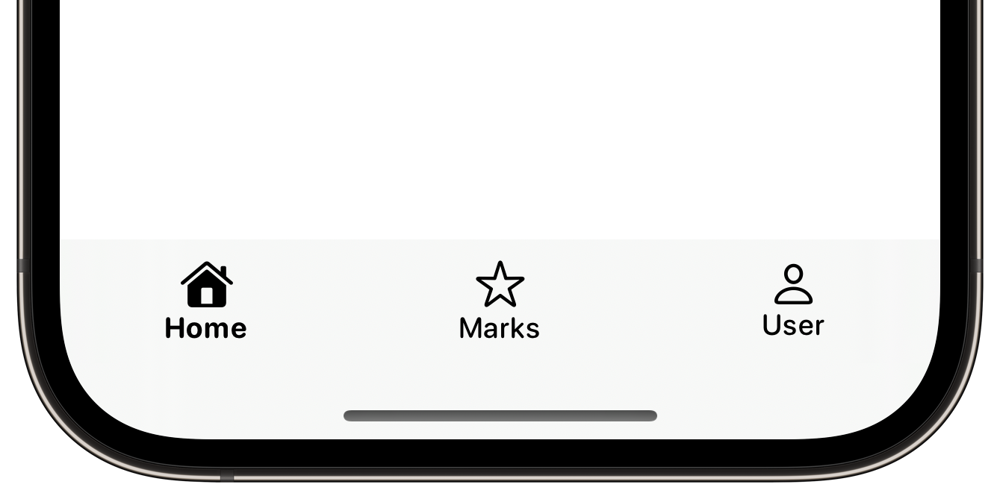
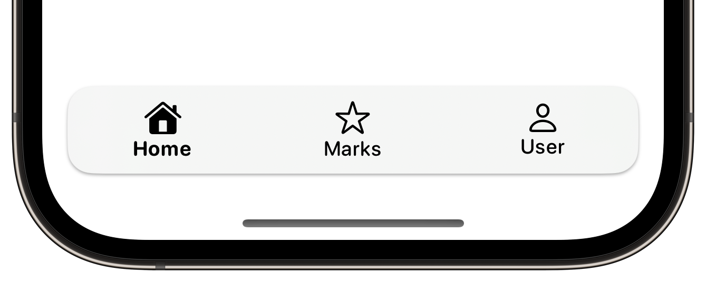
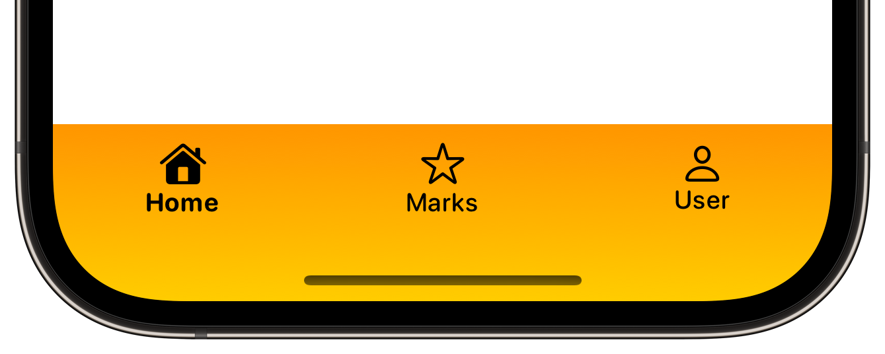
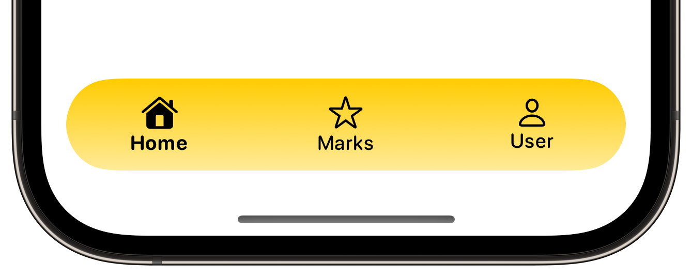

- [Installation](#installation)
- [Usage](#usage)
  - [Shape and Fill Style](#shape-and-fill-style)
  - [Visibility with Animation and Transition](#visibility-with-animation-and-transition)

# TabBar

<p align="left">
<a href="https://www.swift.org"></a>
<a href="https://developer.apple.com/ios/"></a>
<a href="https://developer.apple.com/documentation/SwiftUI"></a>
<a href="https://www.swift.org/package-manager/"></a>
<a href="https://www.apache.org/licenses/LICENSE-2.0.txt"></a>
</p>

**`TabBar`** is a highly customizable tab bar view made in SwiftUI that functions similarly to [`TabView`](https://developer.apple.com/documentation/swiftui/tabview).

## Installation

Requirement: iOS 15.0+

This package can be installed using the [Swift Package Manager](https://www.swift.org/package-manager/)(SPM).

Add the following line to the dependencies in `Package.swift`, to use the `TabBarModule` in a SPM project:

```swift
.package(url: "https://github.com/zijievv/swiftui-tab-bar", from: "0.0.1"),
```

 In your executable target:

```swift
.target(name: "<TARGET_NAME>", dependencies: [
    .product(name: "TabBarModule", package: "swiftui-tab-bar"),
    // ...
]),
```

Add `import TabBarModule` into your source code to use `TabBar`.

## Usage

Similar to `TabView`, the `TabBar` accepts a Binding value that conforms to `Hashable`.

```swift
import SwiftUI
import TabBarModule

struct ContentView: View {
    @State private var item: Int = 0

    var body: some View {
        TabBar(selection: $item) {
            HomeView()
                .tabItem(0) {
                    Image(systemName: item == 0 ? "house.fill" : "house")
                        .font(.title3)
                    Text("Home")
                        .font(.system(.footnote, design: .rounded).weight(item == 0 ? .bold : .medium))
                }
            MarksView()
                .tabItem(1) {
                    Image(systemName: item == 1 ? "star.fill" : "star")
                        .font(.title3)
                    Text("Marks")
                        .font(.system(.footnote, design: .rounded).weight(item == 1 ? .bold : .medium))
                }
            UserView()
                .tabItem(2) {
                    Image(systemName: item == 2 ? "person.fill" : "person")
                        .font(.title3)
                    Text("User")
                        .font(.system(.footnote, design: .rounded).weight(item == 2 ? .bold : .medium))
                }
        }
    }
}
```

The `TabBar` provides a default style when no other modifiers are set.



With modifiers, it is easy to set the `TabBar`'s styles.

```swift
TabBar(selection: $item) {
    // ...
}
.tabBarFill(.regularMaterial)
.tabBarMargins(.vertical, 8)
.tabBarPadding(.vertical, 8)
.tabBarPadding(.horizontal, 16)
.tabBarShape(RoundedRectangle(cornerRadius: 16, style: .continuous))
.tabBarShadow(radius: 1, y: 1)
```



### Shape and Fill Style

The `TabBar` accepts any fill that conforms to the `ShapeStyle` protocol.

```swift
TabBar(selection: $item) {
    // ...
}
.tabBarFill(.linearGradient(colors: [.orange, .yellow], 
                            startPoint: .top, endPoint: .bottom))
.tabBarMargins(.vertical, 8)
```



The `TabBar` also accepts any background shape that conforms to the `Shape` protocol (e.g., Capsule).

```swift
TabBar(selection: $item) {
    // ...
}
.tabBarMargins(.vertical, 8)
.tabBarPadding(.vertical, 8)
.tabBarPadding(.horizontal, 16)
.tabBarShape(Capsule(style: .continuous))
.tabBarFill(.linearGradient(colors: [.yellow, .yellow.opacity(0.4)], 
                            startPoint: .top, endPoint: .bottom))
```



### Visibility with Animation and Transition

The `TabBar` accepts a Binding value of type `Visibility` to control its visibility. When visibility is set to `.automatic`, the `TabBar` will observe the keyboard's appearance to automatically show or hide itself.

You can customize the animation and transition for the appearance and disappearance of the `TabBar`.

```swift
TabBar(selection: $item, visibility: $visibility) {
    // ...
}
.tabBarTransition(.move(edge: .bottom).combined(with: .opacity))
.tabBarAnimation { isTabBarVisible in
    isTabBarVisible ? .easeInOut(duration: 0.2).delay(0.15) : .linear(duration: 0.25)
}
```
